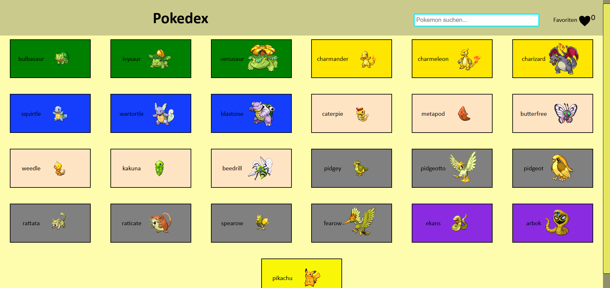
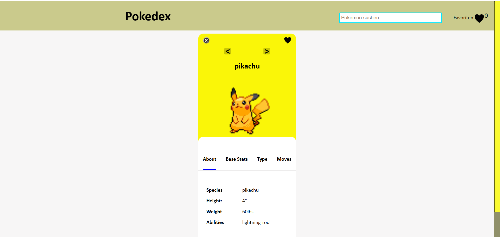

# Pokédex

A responsive Pokédex web application built with Vanilla JavaScript and the PokeAPI.

The application loads Pokémon data from an external REST API and displays it in an interactive user interface. The project was created to practice asynchronous data handling, API integration, DOM manipulation and responsive web development.

## Preview

### Detailed Pokémon view

## Features
- Fetches Pokémon data from the PokeAPI
- Dynamic rendering of Pokémon cards
- Detailed Pokémon views with:
  - basic information
  - stats
  - types
  - moves
- Search functionality
- Favourite Pokémon
- Persistent favourites using LocalStorage
- Previous / next Pokémon navigation
- Responsive layout
- Mobile navigation

## Technologies
- HTML5
- CSS3
- JavaScript
- Fetch API
- async / await
- REST API
- JSON
- LocalStorage
- Responsive Web Design

## What I learned
This project helped me gain practical experience with:

- retrieving and processing data from external APIs
- asynchronous JavaScript
- handling application state
- dynamically generating user interfaces
- storing data locally in the browser
- adapting interfaces for desktop and mobile devices

## Project context
This is an earlier learning project and reflects my development experience at that stage. Since then, I have continued working on larger applications involving desktop software, backend services, document processing and mobile development.
